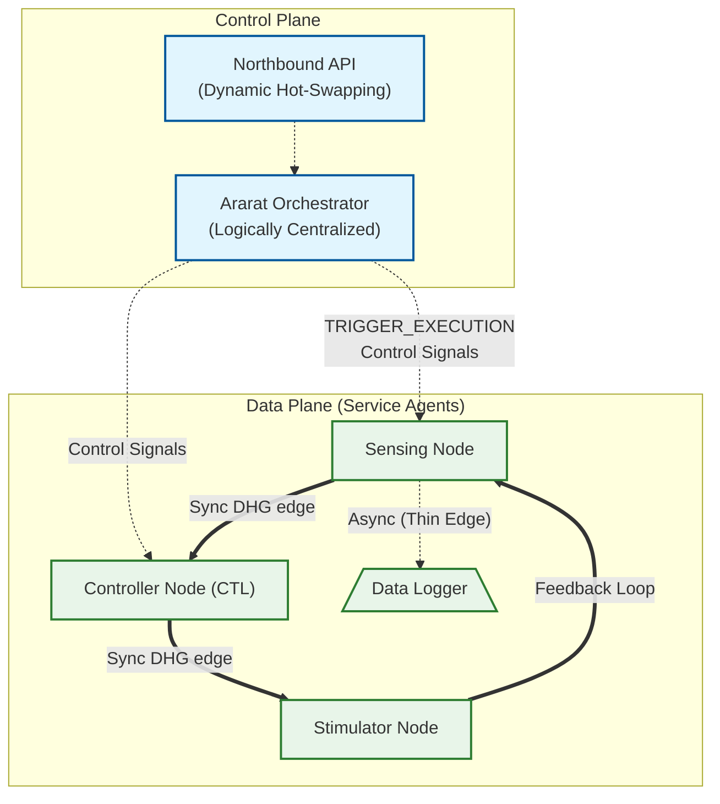

# Ararat: Software-Defined DHG Workflow Orchestrator

[](https://www.modular.com/mojo)
[](#research-parity)

**Ararat** is a high-performance, logically centralized orchestration framework for **Software-Defined Workflows (SDW)**. Built in the **Mojo** programming language, it leverages **Directed Hypergraphs (DHG)** to model and execute complex, distributed closed-loop systems—specifically optimized for neuromodulation control systems.

---

## Core Philosophy



Ararat is inspired by **Software-Defined Networking (SDN)**, separating the **Control Plane** (Orchestration) from the **Data Plane** (Service Execution). This allows for:

-   **Directed Hypergraphs (DHG)**: Moving beyond the constraints of DAGs to support cycles, feedback loops, and 1-to-many hyperedges.
-   **Logically Centralized Control**: A unified orchestrator manages the workflow state while data flows orthogonally between distributed services.
-   **Heterogeneous Execution**: Native support for polyglot services running in **Docker**, **Singularity**, or as local processes.
-   **Dynamic Adaptability**: Real-time "Hot-Swap" of workflow topologies without resetting service context.

---

## Key Features

### Closed-Loop Support (Cycles)
Unlike traditional workflow engines (Nextflow, Snakemake) that are limited to Directed Acyclic Graphs, Ararat natively supports **Dicycles**. This is critical for biomedical control systems where continuous feedback loops (e.g., Plant Model $\leftrightarrow$ Optimizer) are the norm.

### Asynchronous "Thin Edges"
Supports both **Blocking (Synchronous)** and **Non-Blocking (Asynchronous)** signaling. "Thin Edges" allow nodes to continue execution while receiving fire-and-forget state updates, preventing bottlenecks in high-frequency data streams.

### Container-First Infrastructure
Built-in `ServiceLauncher` capable of orchestrating:
-   **Cloud-Native**: Dockerized microservices.
-   **HPC-Native**: Singularity (Apptainer) containers for research clusters.
-   **Local**: Standalone Mojo/Python scripts.

### Dynamic Hot-Swapping
The Orchestrator can ingest new YAML definitions during an active run, re-routing hyperedges and altering the control logic with zero downtime.

---

## Project Structure

```text
Ararat/
├── ararat/
│   ├── core/           # DHG Primitives (Nodes, Hyperedges)
│   ├── controller/     # Logically Centralized Orchestrator
│   ├── infra/          # Container Launchers & YAML Parsers
│   ├── sim/            # Closed-loop case studies & benchmarks
│   └── optimization/   # Resource & Bandwidth allocation heuristics
├── workflows/          # YAML-based DHG definitions
└── main.mojo           # Entry point
```

---

## Getting Started

### Installation & Setup

Ararat is managed using **Pixi**. This ensures all dependencies, including the Mojo SDK, are correctly versioned and isolated.

1.  **Install Pixi**:
    ```bash
    curl -fsSL https://pixi.sh/install.sh | bash
    ```
    *Restart your terminal or run `source ~/.bashrc` after installation.*

2.  **Install Dependencies**:
    Navigate to the project root and run the following to install Mojo and other dependencies:
    ```bash
    pixi install
    ```

3.  **Verify the Installation**:
    ```bash
    pixi run mojo --version
    ```

### Other Prerequisites
- **Python 3.x**: For YAML interoperability and orchestrator subprocess management.
- **Docker / Apptainer**: (Optional) For orchestrating containerized services.

### Running a Simulation
Ararat includes a case study of a **Neuromodulation Control Loop**:

```bash
# Run the complete verification suite using Pixi
pixi run mojo main.mojo
```

### Creating Custom Workflows

Ararat inherently focuses on zero-code deployments via declarative topologies natively in **YAML**, while also exposing its raw Mojo primitives programmatically.

For comprehensive instructions on how to design YAML schemas and inject hot-swaps using the native `WorkflowParser`, please refer to the **[Ararat User Guide](USER-GUIDE.md)**.

---


