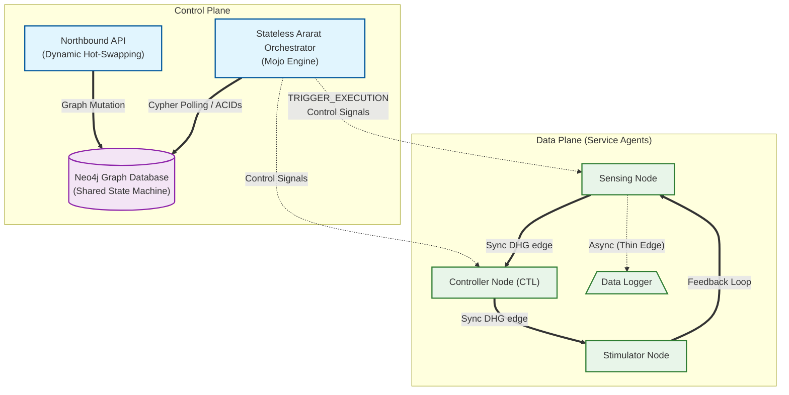

# Ararat: Neo4j-Native Software-Defined DHG Workflow Orchestrator

[](https://www.modular.com/mojo)
[](#research-parity)

**Ararat** is a general-purpose, high-performance orchestration framework for **Software-Defined Workflows (SDW)**. Built in the **Mojo** programming language and integrated natively with the **Neo4j** graph database, it leverages **Directed Hypergraphs (DHG)** to model and execute complex, distributed closed-loop systems (such as neuromodulation control systems).

---

## Core Philosophy



Ararat separates the **Control Plane** (Orchestration State & Rules) from the **Data Plane** (Service Execution), utilizing a database-driven architecture:

-   **Neo4j-Native Control**: The Directed Hypergraph workflow topology and execution states are stored directly in a Neo4j property graph.
-   **Stateless Mojo Orchestrators**: Multiple stateless, high-performance Mojo execution engines query and claim tasks atomically using Cypher queries, eliminating centralized state bottlenecks.
-   **Graph-Native Algorithms**: Performs topological operations (such as cycle checking and transitive downstream path pruning for fault isolation) directly in the database.
-   **Directed Hypergraphs (DHG)**: Natively supports complex topological patterns, including cycles, dicycles, and 1-to-many hyperedges.
-   **Dynamic Adaptability**: Real-time "Hot-Swap" of active workflow topologies by executing basic graph mutations on the Neo4j database, without restarting running orchestrators or service agents.

---

## Key Features

### Closed-Loop Support (Cycles)
Unlike traditional workflow engines (Nextflow, Snakemake) that are limited to Directed Acyclic Graphs, Ararat natively supports **Dicycles**. This is critical for biomedical control systems where continuous feedback loops (e.g., Plant Model $\leftrightarrow$ Optimizer) are the norm.

### Asynchronous "Thin Edges"
Supports both **Blocking (Synchronous)** and **Non-Blocking (Asynchronous)** signaling. "Thin Edges" allow nodes to continue execution while receiving fire-and-forget state updates, preventing bottlenecks in high-frequency data streams.

### Container-First Infrastructure
Built-in `ServiceLauncher` capable of orchestrating:
-   **Cloud-Native**: Dockerized microservices.
-   **HPC-Native**: Singularity (Apptainer) containers for research clusters.
-   **Local**: Standalone Mojo/Python scripts.

### Dynamic Hot-Swapping
The Orchestrator can ingest new YAML definitions during an active run, re-routing hyperedges and altering the control logic with zero downtime.

---

## Project Structure

```text
Ararat/
├── src/
│   ├── core/           # DHG Primitives (Nodes, Hyperedges)
│   ├── controller/     # Logically Centralized Orchestrator
│   ├── infra/          # Container Launchers & YAML Parsers
│   ├── sim/            # Closed-loop case studies & benchmarks
│   └── optimization/   # Resource & Bandwidth allocation heuristics
├── scripts/
│   ├── bayesian_optimizer.py        # Local Python node
│   └── neuromod-pm/                 # Docker node
│       ├── Dockerfile
│       └── plant_model.sh
├── workflows/          # YAML-based DHG definitions
├── setup.sh            # Idempotent environment setup
├── main.mojo           # CLI runner for custom user workflows
└── run_use_cases.mojo  # Verification suite running pre-defined research use cases
```

---

## Getting Started

### Installation & Setup

Ararat is managed using **Pixi**. Run the bundled setup script — it checks for
existing installations and skips any step that is already satisfied:

```bash
bash setup.sh
```

The script handles:
- Installing **Pixi** (if not already on `PATH`)
- Running `pixi install` to install Mojo and PyYAML (if not already solved)
- Building the **Docker image** `kathiravelulab/neuromod-pm:latest` (if not already present)
- Verifying the installation with `pixi run mojo --version`

> If you prefer to run steps manually, see [Tutorial.md](Tutorial.md#prerequisites).

### Running Predefined Use Cases
To execute the bundled research use cases (Neuromodulation Control Loop, Dynamic Hot-Swap, Network-Aware Routing, etc.):

```bash
# Run the complete verification suite using Pixi
pixi run mojo run_use_cases.mojo
```

### Executing Custom Workflows (CLI)
Ararat allows you to run any user-defined workflow YAML directly through the CLI:

```bash
# Run a custom workflow YAML definition
pixi run mojo main.mojo workflows/neuromodulation.yaml --iterations 5
```

### Reproducing Paper Experiments & Plots
To run the evaluation benchmarks described in the paper and regenerate the exact plots presented:

1. Execute the main evaluation simulation to produce the raw CSV metrics:
   ```bash
   pixi run mojo run_use_cases.mojo
   ```
   This will generate `evaluation_metrics.csv` in the `scripts/` directory.

2. Run the plot generator script to consume the CSV and output the PDF figure:
   ```bash
   python3 scripts/generate_plots.py
   ```
   This will output `evaluation_results.pdf` in the `scripts/` directory.

### Creating Custom Workflows

Ararat inherently focuses on zero-code deployments via declarative topologies natively in **YAML**, while also exposing its raw Mojo primitives programmatically.

For comprehensive instructions on how to design YAML schemas and inject hot-swaps using the native `WorkflowParser`, please refer to the **[Ararat User Guide](USER-GUIDE.md)**.

---


